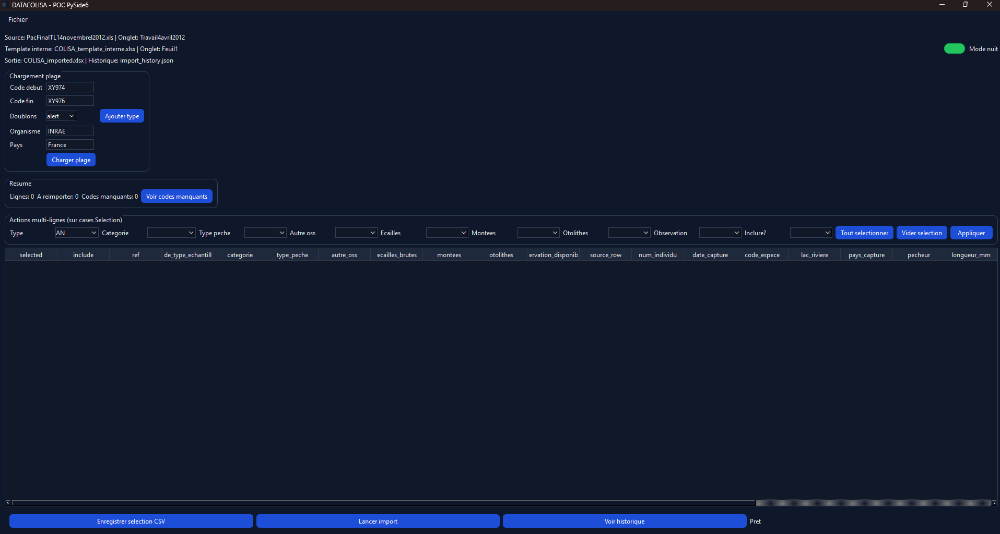

# DATACOLISA - Software Guide

## Purpose
DATACOLISA is a business import tool used to transfer data from a source Excel file into a target template, with user validation before writing.

## Requirements / Installation
- Recommended Python version: `3.12` (`3.11+` usually works, but `3.12` is the project baseline).
- Install dependencies:

```powershell
python -m venv .venv
.\.venv\Scripts\Activate.ps1
pip install -r requirements.txt
```

## Quick Start (what to run)
- Main interface (recommended): `python app/ui_pyside6_poc.py`
- Import script / CLI mode (advanced): `python app/datacolisa_importer.py --help`

## Preview


## What the Software Does
- Loads a source `.xls` Excel file.
- Filters rows based on a reference range (`REF`).
- Allows manual row selection before import.
- Validates required business fields.
- Imports data into the target template while preserving computed columns.
- Handles duplicates with a selectable policy (`alert`, `ignore`, `replace`).
- Produces import history files for tracking and re-import workflows.

## Supported Base Format
The software currently supports a single data base format:
- Expected source: `.xls` file matching DATACOLISA business structure.
- Expected source sheet: `Travail4avril2012`.
- Expected target file: `Mapping/COLISA_template_interne.xlsx`.
- Expected target sheet: `Feuil1`.
- Fixed mapping: business headers/positions defined in code (`app/datacolisa_importer.py`).

If the source structure changes (columns, sheet, positions), the mapping must be updated in code.

## Usage (PySide6 Interface)
1. Start `app/ui_pyside6_poc.py` (or the executable, if already built).
2. Select the source `.xls` file.
3. Check the `REF` range to process.
4. Load rows and verify selection in the table.
5. Run import to the output file.
6. Review the history file statuses (`importe`, `non_importe_manuel`, `a_reimporter`).

## Files Used
- Local business input: user `.xls` file.
- Template: `Mapping/COLISA_template_interne.xlsx`.
- Local outputs: `COLISA_imported*.xlsx`, `import_history*.json`, `selection_import.csv`.
- Python dependencies: `requirements.txt`.

## Business Data and Git
- This repository contains source code, assets, and template files, but not production data sets.

## Development Support
This repository benefited from AI-assisted support for syntax optimization and documentation.

## License
This project is licensed under the GNU General Public License v3.0 (GPL-3.0).
See `LICENSE`.
