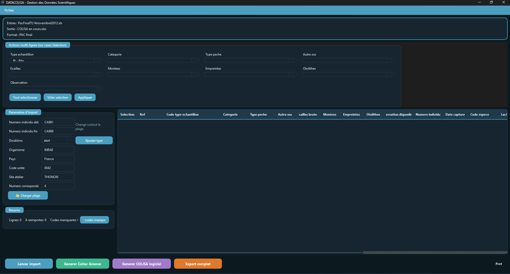

# DATACOLISA

DATACOLISA is a Python desktop application for importing, validating, and exporting ichthyological collection data into DATACOLISA / COLISA workflows.

## Preview

This section is ready for GitHub screenshots. Add your images to `docs/previews/` and replace the sample links below.

```md


```

## Features

- Import source Excel files (`.xls` and `.xlsx`)
- Validate business rules before integration
- Generate and update `COLISA en cours` workbooks
- Export data to Collect-Science and COLISA software formats
- Track import history and duplicate handling
- Run the workflow from a PySide6 desktop interface

## Tech Stack

- Python
- PySide6
- openpyxl
- xlrd
- PyInstaller

## Repository Layout

```text
.
|-- code/
|   |-- application/                    # Application services used by the UI and CLI
|   |-- assets/                         # Icons, templates, embedded workbook assets
|   |-- config/                         # Constants and configuration mappings
|   |-- domain/                         # Business rules, models, value objects
|   |-- infrastructure/                 # Excel I/O, paths, and persistence helpers
|   |-- presentation/                   # Dialogs, models, delegates, and UI helpers
|   |-- datacolisa_importer.py          # Command-line importer
|   |-- generer_collec_science.py       # Collect-Science export logic
|   |-- generer_colisa_logiciel.py      # COLISA software export logic
|   |-- le_visage.py                    # Main desktop entry point
|   |-- DATACOLISA.spec                 # PyInstaller spec file
|   `-- requirements.txt                # Python dependencies
|-- docs/
|   `-- previews/                       # GitHub screenshots
|-- scripts/
|   `-- windows/                        # Windows build helpers
|-- .gitignore
`-- README.md
```

## Main Scripts

- `code/le_visage.py`: main desktop application window
- `code/datacolisa_importer.py`: CLI entry point for extract/import/reimport workflows
- `code/generer_collec_science.py`: export engine for Collect-Science outputs
- `code/generer_colisa_logiciel.py`: export engine for COLISA software workbooks

All remaining Python files in the repository are part of the active app, an active export/CLI workflow, or a required runtime/build dependency. Unused experimental template-management files were removed during cleanup.

## Installation

```bash
python -m venv .venv
.venv\Scripts\activate
pip install -r code/requirements.txt
```

## Run the App

From the repository root:

```bash
python code/le_visage.py
```

## Build the Executable

Manual build:

```bash
cd code
pyinstaller DATACOLISA.spec
```

Windows helper script:

```bash
scripts\windows\CREER_EXE_PORTABLE.bat
```

## Organization Notes

- Local cache files, logs, IDE files, generated data, and runtime folders are ignored in `.gitignore`
- Build helper scripts are separated into `scripts/windows/`
- UI-only dialogs are grouped under `code/presentation/`
- The repository now keeps only files with a clear functional role

## Notes

- This project is intended for desktop/internal usage
- Runtime working files are generated by the application and should not be committed
